# Entrega — Prova do Primeiro Bimestre (DevOps)

**Aluno:** Felipe Gomes Mariano 
**RA:** 3225014
**Data:** 01/09/2026    
**Ferramenta de IA utilizada:** Claude Code 

## Repositório do Projeto

- URL: https://github.com/felipem004/prova-primeiro-bimestre-devops

## Checklist de Evidências

- [X] Repositório público com README (nome + RA) e .gitignore
- [X] Mínimo de 6 commits com Conventional Commits + feature branch
- [X] API com **CRUD completo** de reservas (POST, GET, GET/:id, PUT, DELETE) + /health
- [X] Rotas de CRUD gravando no **banco PostgreSQL** (não em memória)
- [X] Dockerfile funcional da API de Reservas
- [X] docker-compose.yml (API + PostgreSQL) subindo com um comando
- [X] Terraform modularizado (vpc, security-group, ec2, rds)
- [X] **RDS PostgreSQL provisionado** nas subnets privadas (banco da API na nuvem)
- [X] Remote State configurado (S3 + DynamoDB)
- [X] Uso de LabRole/LabInstanceProfile (sem criar IAM próprio)
- [X] terraform validate e terraform plan sem erros
- [X] relatorio.md completo (4 questões)
- [X] terraform destroy executado após evidências

## Evidências

[Cole aqui os outputs/screenshots: docker compose ps, terraform plan, etc.]

# Evidencias do Docker:
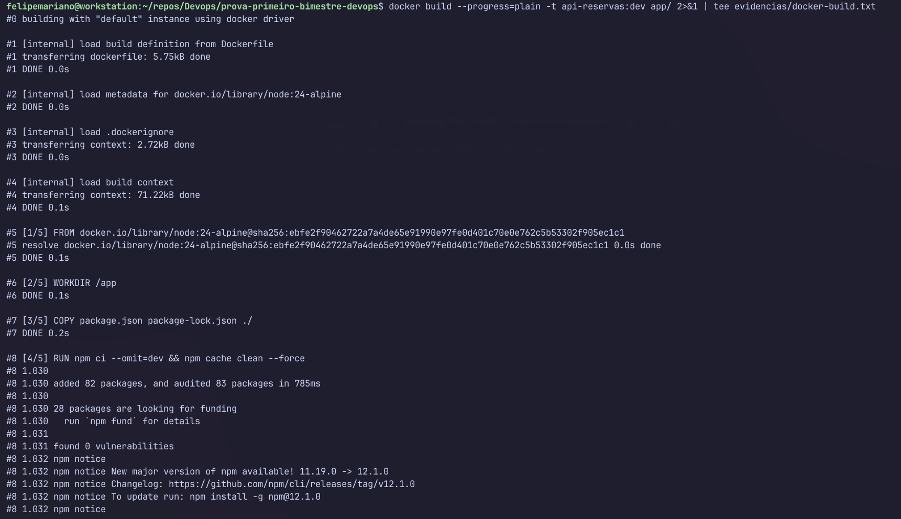

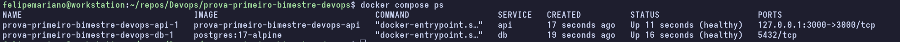

# Evidencias do Terraform:
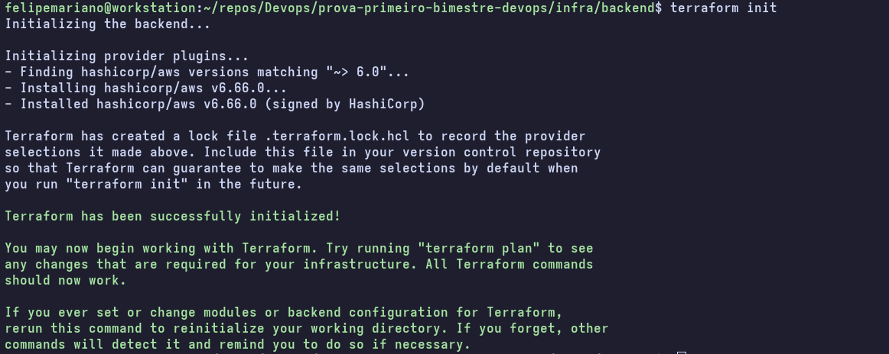

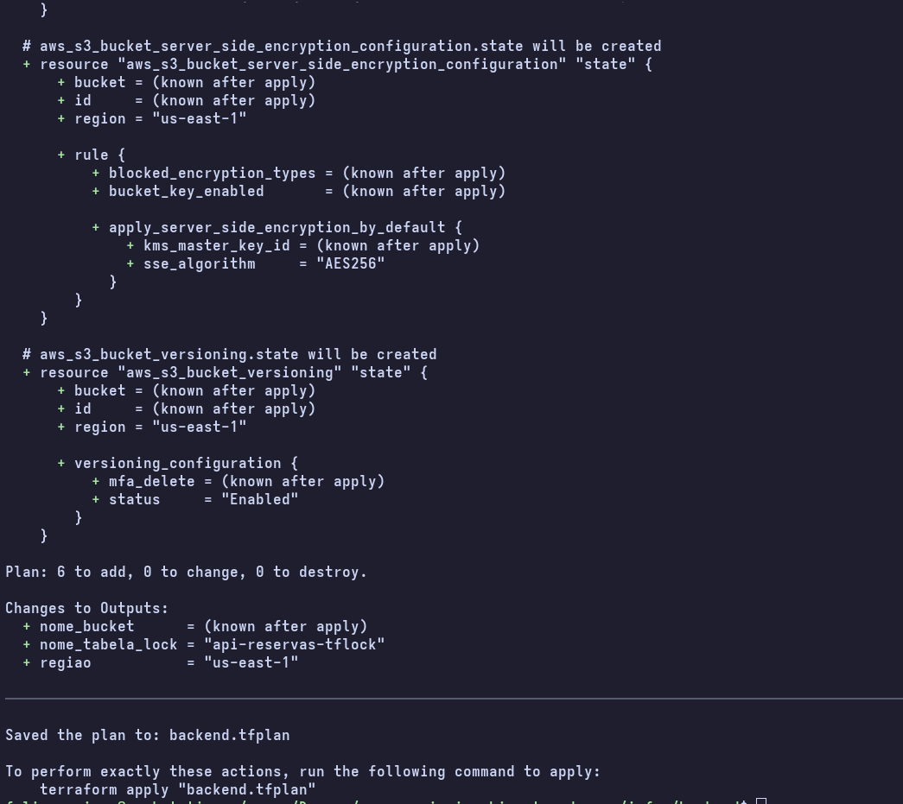

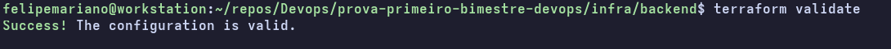

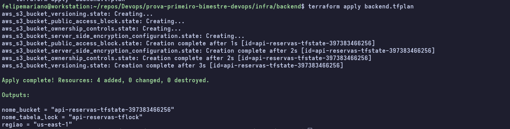

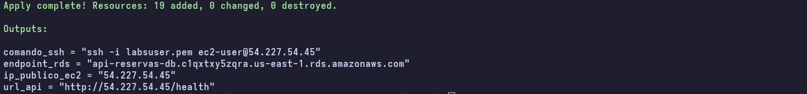

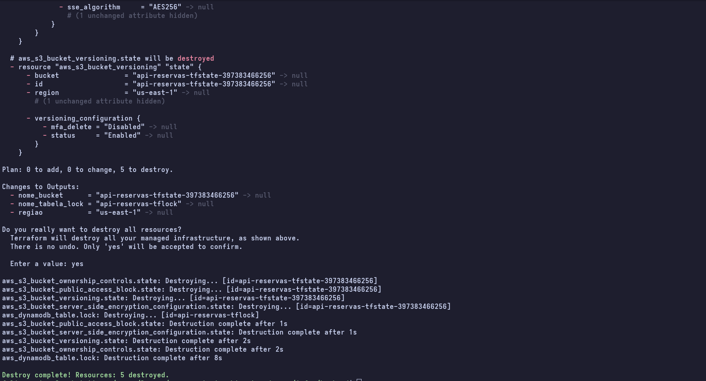

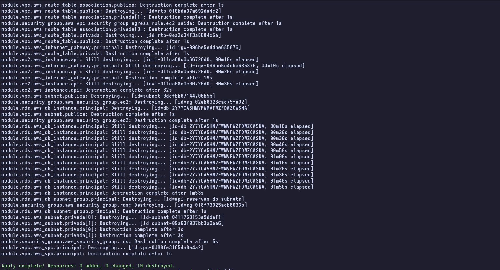

# Evidencias de persistências:
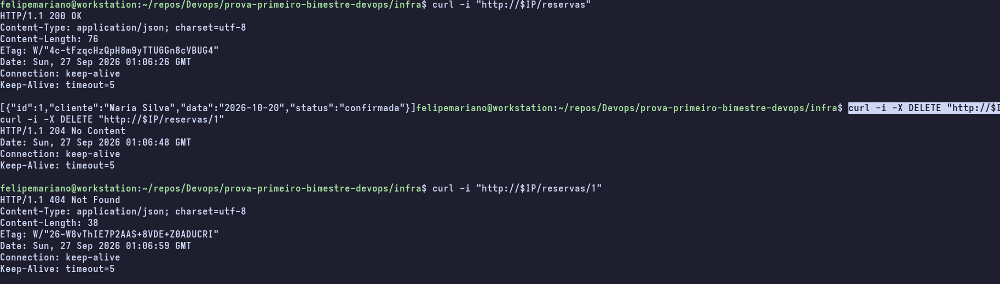

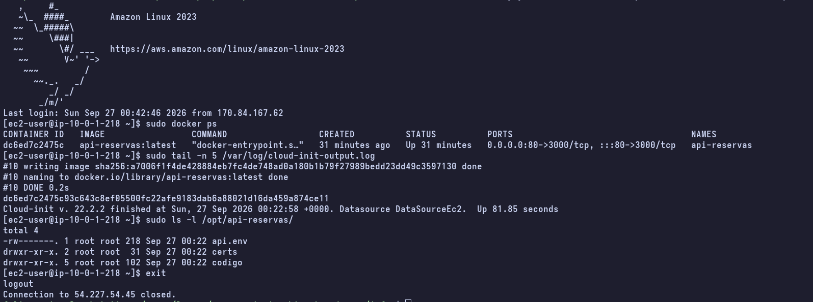

