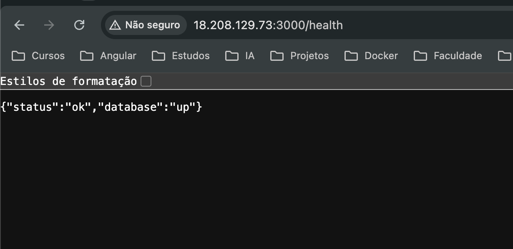
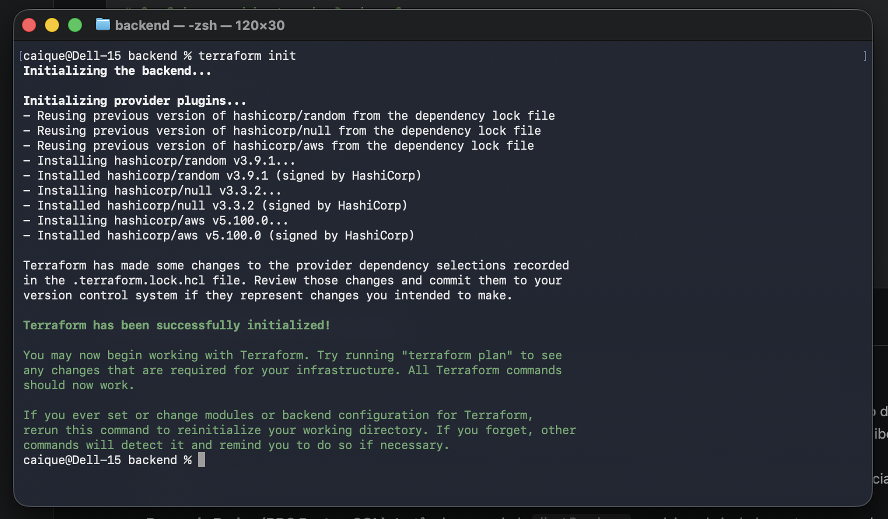
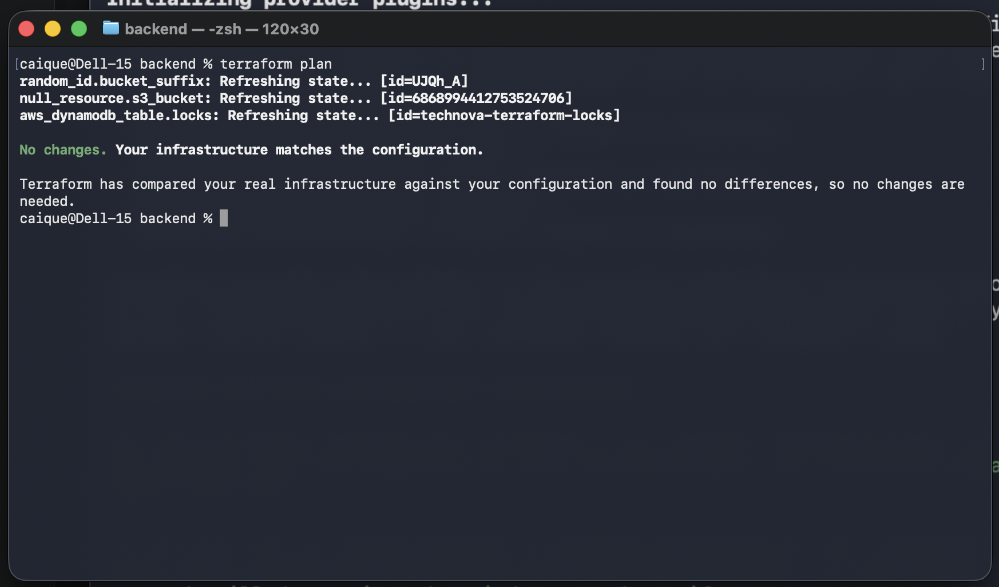
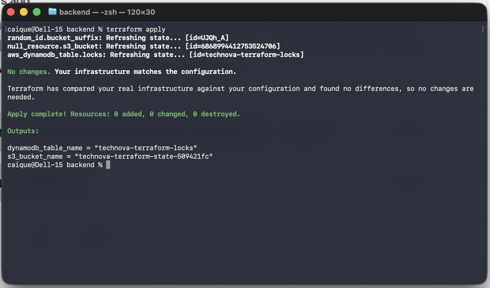
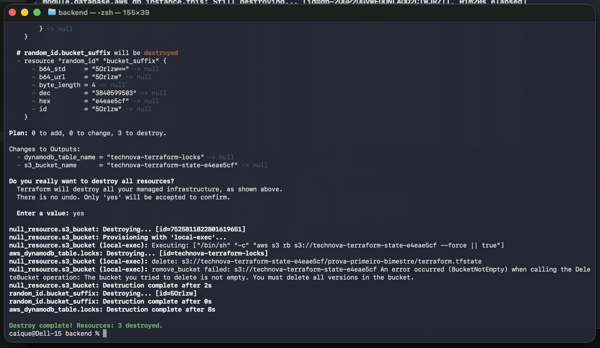
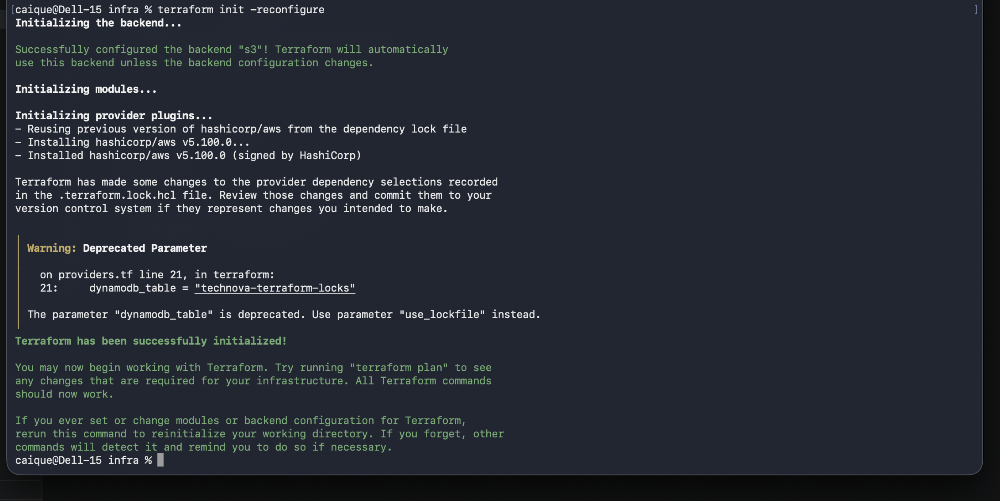
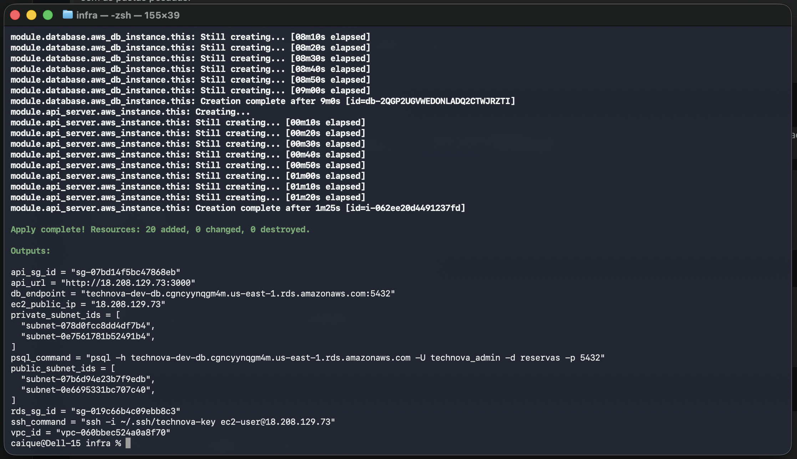
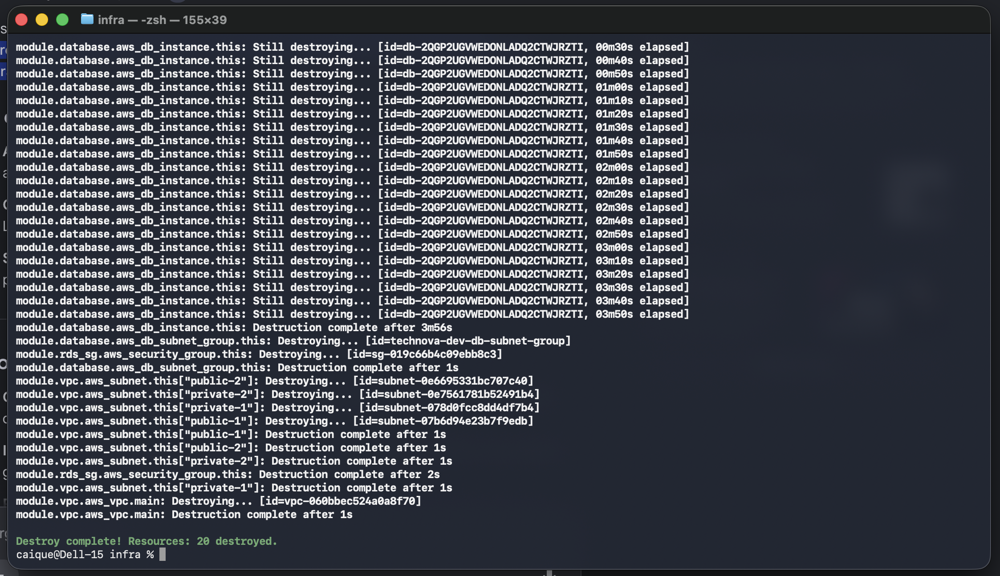

# Entrega — Prova do Primeiro Bimestre (DevOps)

**Aluno:** Caique Pereira de Souza
**RA:** 6325095
**Data:** 01/10/2025
**Ferramenta de IA utilizada:** Claude e Kiro

## Repositório do Projeto

- URL: https://github.com/CaiqueSouzaa/prova-primeiro-bimestre-devops

## Checklist de Evidências

- [x] Repositório público com README (nome + RA) e .gitignore
- [x] Mínimo de 6 commits com Conventional Commits + feature branch
- [x] API com **CRUD completo** de reservas (POST, GET, GET/:id, PUT, DELETE) + /health
- [x] Rotas de CRUD gravando no **banco PostgreSQL** (não em memória)
- [x] Dockerfile funcional da API de Reservas
- [x] docker-compose.yml (API + PostgreSQL) subindo com um comando
- [x] Terraform modularizado (vpc, security-group, ec2, rds)
- [x] **RDS PostgreSQL provisionado** nas subnets privadas (banco da API na nuvem)
- [x] Remote State configurado (S3 + DynamoDB)
- [x] Uso de LabRole/LabInstanceProfile (sem criar IAM próprio)
- [x] terraform validate e terraform plan sem erros
- [x] relatorio.md completo (4 questões)
- [x] terraform destroy executado após evidências

## Evidências

### 1. Docker Build

```
#0 building with "desktop-linux" instance using docker driver

#1 [internal] load build definition from Dockerfile
#1 transferring dockerfile: 1.72kB 0.0s done
#1 DONE 0.1s

#14 [build 6/6] RUN npm run build
#14 1.355 > reservas@0.0.1 build
#14 1.355 > nest build
#14 DONE 15.7s

#19 exporting to image
#19 naming to docker.io/library/reservas-api:latest done
#19 DONE 0.3s
```

### 2. Docker Compose PS + Health Check

```
$ docker compose ps
NAME                  IMAGE                COMMAND                  SERVICE    CREATED          STATUS                    PORTS
reservas-backend-1    reservas-backend     "docker-entrypoint.s…"   backend    24 seconds ago   Up 18 seconds (healthy)   0.0.0.0:3000->3000/tcp, [::]:3000->3000/tcp
reservas-postgres-1   postgres:16-alpine   "docker-entrypoint.s…"   postgres   24 seconds ago   Up 24 seconds (healthy)   5432/tcp

$ curl -s http://localhost:3000/health
{"status":"ok","database":"up"}
```

### 3. API Health Test



### 4. Terraform Backend — Init, Plan, Apply e Destroy









### 5. Terraform Infra — Init, Apply e Destroy







### 6. Terraform Plan (saída completa)

```
data.aws_ami.amazon_linux: Reading...
data.aws_ami.amazon_linux: Read complete after 2s [id=ami-07f9c6534b9c70941]

Terraform used the selected providers to generate the following execution
plan. Resource actions are indicated with the following symbols:
  + create

Terraform will perform the following actions:

  # aws_key_pair.this will be created
  # module.api_server.aws_instance.this will be created
  #   iam_instance_profile = "LabInstanceProfile"
  #   instance_type        = "t2.micro"
  # module.api_sg.aws_security_group.this will be created
  #   description          = "API - SSH e porta 3000"
  # module.database.aws_db_instance.this will be created
  #   db_name              = "reservas"
  #   engine               = "postgres"
  #   engine_version       = "15"
  #   instance_class       = "db.t3.micro"
  #   publicly_accessible  = false
  # module.database.aws_db_subnet_group.this will be created
  #   name                 = "technova-dev-db-subnet-group"
  # module.rds_sg.aws_security_group.this will be created
  #   description          = "RDS - PostgreSQL apenas do SG da EC2"
  # module.vpc.aws_vpc.main will be created
  #   cidr_block           = "10.0.0.0/16"
  # Subnets públicas (us-east-1a, us-east-1b) e privadas (us-east-1a, us-east-1b)

Plan: 20 to add, 0 to change, 0 to destroy.
```

> Saída completa do `terraform plan` disponível em `evidencias/terraform-plan.txt`.

### 7. Histórico de Commits (Conventional Commits)

```
e015e3e docs(evidencias): adiciona saída do terraform plan da infra
183622f chore(git): remove infra/backend/.terraform.lock.hcl do versionamento
760a7be fix(relatorio): corrige descrição do Compose/RDS na Q1 e do SG do RDS na Q3
7406eee docs: adiciona link para relatorio.md no README e atualiza lock files
e01d09f chore(git): expande .gitignore para cobrir todos os diretórios .terraform recursivamente
b8897c4 fix(infra): restringe acesso ao RDS ao SG da EC2 (menor privilégio)
f3cb7b7 feat(infra/security-group): adiciona suporte a source_security_group_id nas regras de ingress
3b01035 docs: inclusão das evidencias
be04fa2 docs: adiciona alerta de compatibilidade de SO e configuração via aws configure no README
0335a27 fix(infra/ec2): aumenta volume root de 8GB para 30GB
b971082 docs(relatorio): conclusão do relatorio.md
bc2f77e fix: corrigido o nome do S3 para que o usuário modifique
bfc4933 chore: remove enunciado da prova e adiciona esqueleto do relatório
43670a5 chore(git): atualiza .gitignore para cobrir terraform.tfvars e arquivos sensíveis
d37054c docs: atualiza README com passo a passo completo da infraestrutura AWS
93c3e9c docs(infra): documenta problema da SCP do Learner Lab e solução adotada
61f1ec7 fix(infra/backend): contorna SCP do Learner Lab criando bucket S3 via AWS CLI
```

> Total: 61 commits. Feature branch: `refactor/estrutura-prova`.
